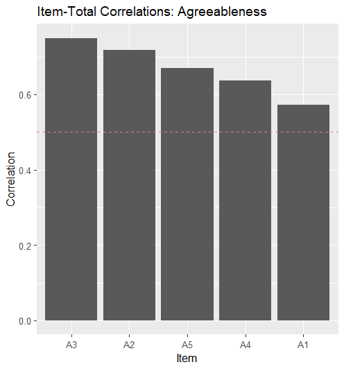
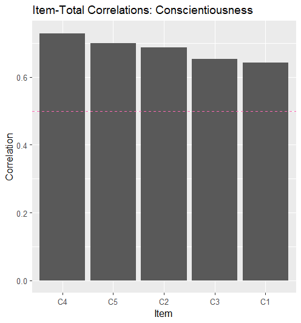
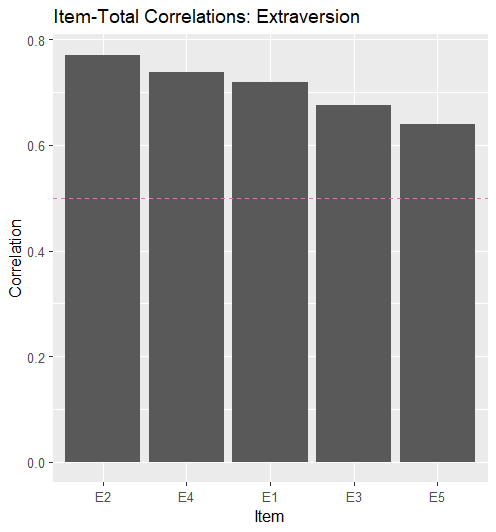
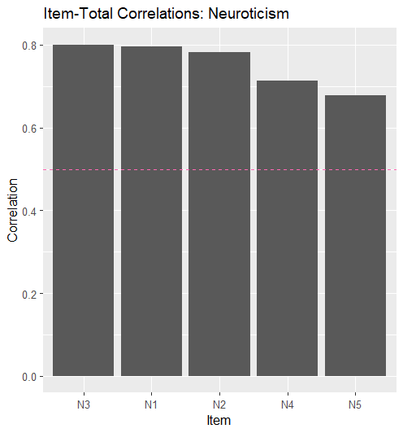
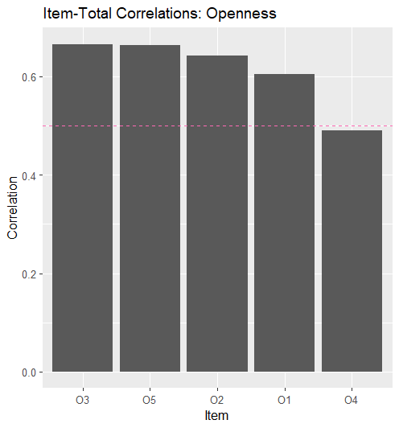

# Item Level Analysis of BFI-25

## Overview

In this project, I carried out an item level analysis of the BFI-25. The 25-item Big Five Inventory data set is an abbreviated assessment designed to measure the five core personality traits: Openness, Conscientiousness, Extraversion, Agreeableness, and Neuroticism (OCEAN).

## Methods

The initial data set contained 2800 participants. Given this large sample size, correlation estimates are considered highly stable and my interpretation focuses on magnitude rather than statistical significance.

Although documentation suggests a 5-point scale, the data set contained responses ranging from 1-6, indicating a 6-point implementation.

Prior to analysis, I prepared the raw data by reverse-coding items and and looping through each, before adding to the empty vector.

I identified reverse-coded items from the data set documentation, then applied a 7-minus transformation. This reverses the scale of reverse-coded items by subtracting each response value from 7, so that low responses (1) become high responses (6), and vice versa.

``` r
bfi_clean <- bfi   clean_items <- sub("-", "", reverse_items)  bfi_clean <- bfi_clean %>% mutate(across(all_of(clean_items), ~ 7 - .)) 
```

#### Scoring

I then calculated scale scores using available item responses i.e., missing items were ignored when calculating totals. This created five new columns, one for each Big Five dimension.

#### Statistical Analysis

I then ranked items in descending order to their corrected item-total correlations (CITCs) values. to identify the strongest and weakest contributions to internal consistency. I produced a horizontal bar plot for each dimension to visualize relative item discrimination.

## Results

Standard Thresholds - common conventions:

-   r ≥ .50 → strong discrimination

-   r = .30–.49 → acceptable

-   r \< .30 → potentially problematic

Item N3 showed exceptional strength (r = 0.80). Future investigation could examine whether specific wording or content makes this item particularly effective at measuring neuroticism.

In contrast, item O4 showed the weakest correlation (r = 0.49) with the Openness dimension, just falling below the 0.50 threshold for strong discrimination.

|  |  |  |  |  |
|---------------|---------------|---------------|---------------|---------------|
|  |  |  |  |  |

{width="235"}
