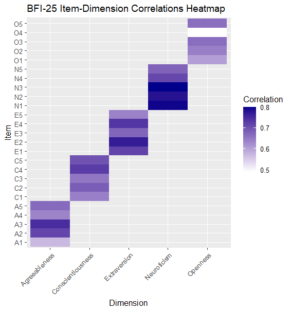

# Item Level Analysis of BFI-25

## Overview

In this project, I carried out an item level analysis of the BFI-25. The 25-item Big Five Inventory data set is an abbreviated assessment designed to measure the five core personality traits: Openness, Conscientiousness, Extraversion, Agreeableness, and Neuroticism (OCEAN).

## Methods

The initial data set contained 2800 participants. Given this large sample size, correlation estimates are considered highly stable and my interpretation focuses on magnitude rather than statistical significance.

Although documentation suggests a 5-point scale, the data set contained responses ranging from 1-6, indicating a 6-point implementation.

Prior to analysis, I prepared the raw data by reverse-coding items and and looping through each, before adding to the empty vector.

I identified reverse-coded items from the data set documentation, then applied a 7-minus transformation. This reverses the scale of reverse-coded items by subtracting each response value from 7, so that low responses (1) become high responses (6), and vice versa.

``` r
bfi_clean <- bfi   clean_items <- sub("-", "", reverse_items)  bfi_clean <- bfi_clean %>% mutate(across(all_of(clean_items), ~ 7 - .)) 
```

#### Scoring

I then calculated scale scores using available item responses i.e., missing items were ignored when calculating totals. This created five new columns, one for each Big Five dimension.

#### Statistical Analysis

I then ranked items in descending order to their corrected item-total correlations (CITCs) values. to identify the strongest and weakest contributions to internal consistency. I produced a horizontal bar plot for each dimension to visualize relative item discrimination.

Following this, I created a heat map showing all 25 items across all 5 dimensions.

## Results

Standard Thresholds - common conventions:

-   r ≥ .50 → strong discrimination

-   r = .30–.49 → acceptable

-   r \< .30 → potentially problematic

Item N3 showed exceptional strength (r = 0.80). Future investigation could examine whether specific wording or content makes this item particularly effective at measuring neuroticism.

In contrast, item O4 showed the weakest correlation (r = 0.49) with the Openness dimension, just falling below the 0.50 threshold for strong discrimination.

>    
>
> > Figure 1. Item-total correlations for the five BFI-25 personality dimensions

> | Dimension         | Rank | Item | Correlation |
> |-------------------|------|------|-------------|
> | Agreeableness     | 1    | A3   | 0.749       |
> | Agreeableness     | 2    | A2   | 0.717       |
> | Agreeableness     | 3    | A5   | 0.669       |
> | Agreeableness     | 4    | A4   | 0.637       |
> | Agreeableness     | 5    | A1   | 0.572       |
> | Conscientiousness | 1    | C4   | 0.729       |
> | Conscientiousness | 2    | C5   | 0.700       |
> | Conscientiousness | 3    | C2   | 0.687       |
> | Conscientiousness | 4    | C3   | 0.654       |
> | Conscientiousness | 5    | C1   | 0.643       |
> | Extraversion      | 1    | E2   | 0.770       |
> | Extraversion      | 2    | E4   | 0.738       |
> | Extraversion      | 3    | E1   | 0.720       |
> | Extraversion      | 4    | E3   | 0.676       |
> | Extraversion      | 5    | E5   | 0.640       |
> | Neuroticism       | 1    | N3   | 0.800       |
> | Neuroticism       | 2    | N1   | 0.795       |
> | Neuroticism       | 3    | N2   | 0.782       |
> | Neuroticism       | 4    | N4   | 0.713       |
> | Neuroticism       | 5    | N5   | 0.678       |
> | Openness          | 1    | O3   | 0.666       |
> | Openness          | 2    | O5   | 0.663       |
> | Openness          | 3    | O2   | 0.642       |
> | Openness          | 4    | O1   | 0.605       |
> | Openness          | 5    | O4   | 0.491       |
>
> | Table 1. Item-total correlations for BFI-25 subscales

The heat map I produced reveals a clear diagonal pattern, showing that items correlate most strongly with the intended BFI-25 dimensions. It can be inferred that the items measured distinct personality constructs with minimal overlap.

> 
>
> | Figure 2. Inter-item correlation heatmap

## Limitations and Next steps

#### Validity

Although I measured item-total correlation, this does not prove the items validity - it measures only that they correlate with their dimension tools. - correlation does not imply causation. My findings are based on one data set, thus a generalization cannot be made.

#### Reliability

I did not calculate Cronbach's alpha in this project, I therefore do not know if the internal consistency of the items within a dimension reliably measure the same construct.

#### Bias

I did not complete an item bias analysis by measuring if items function differently across demographic groups.